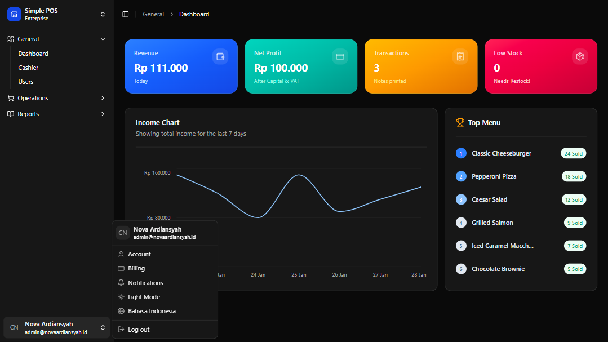
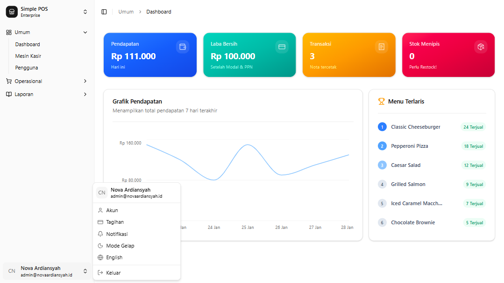
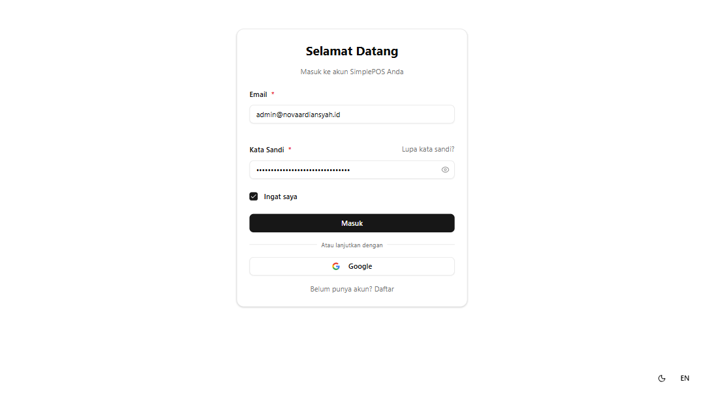

# Simple POS Application

Hi Future Developer,

Welcome to the **Simple POS Application**! This project is a simple point-of-sale application specifically designed for restaurants and eateries. It is built using the latest Next.js and is integrated with a powerful Golang API backend and PostgreSQL database.

This repository focuses on providing a streamlined experience for managing sales, inventory, and restaurant operations. It serves as an ideal starting point for building more complex restaurant management systems or for learning about Next.js and Golang integration.

## Sneak Peek

Take a quick look at the application interface and its key features:

## Dazzling Tech Stack

- [Next.js 16](https://nextjs.org/) - Frontend Framework (React 19)
- [Tailwind CSS 4](https://tailwindcss.com/) - Utility-first CSS Framework
- [shadcn/ui](https://ui.shadcn.com/) - UI Components (Radix UI)
- [TypeScript](https://www.typescriptlang.org/) - Type-safe Development
- [Lucide React](https://lucide.dev/) - Icon set
- [Recharts](https://recharts.org/) - Data Visualization

## Demo Version

You can explore the live version of the application here: [https://simple-pos.novaardiansyah.id/](https://simple-pos.novaardiansyah.id/)

**Credentials:**
- **Email:** *coming soon!*
- **Password:** *coming soon!*

> Note: The credentials for the demo version are currently being prepared. If you need access for testing purposes, please feel free to reach out.

## API Documentation

This project features an integrated backend service developed in Golang. Detailed API documentation is available at: [https://simple-pos-api.novaardiansyah.id/api/documentation](https://simple-pos-api.novaardiansyah.id/api/documentation)

- **Backend API Repository**: [https://github.com/novaardiansyah/simple-pos-api](https://github.com/novaardiansyah/simple-pos-api)

## Credentials & Environment

While this repository is public, please note that all forms of credentials, API keys (including `.env`), and environment configurations are **not provided for the public**. Access to the production database and sensitive configuration remains restricted for security reasons.

If you are interested in using this project for specific purposes or require a demo environment, please contact me directly for **exclusive permission**.

## Let's Connect

Need to chat? Feel free to drop me a line via [Email](mailto:novaardiansyah78@gmail.com) or hit me up on [WhatsApp](https://wa.me/6289506668480?text=Hi%20Nova,%20I%20have%20a%20question%20about%20your%20project%20on%20GitHub:%20https://github.com/novaardiansyah/simple-pos). I'm just a message away, ready to groove with you!

## Project Status

## Code of Conduct

We believe in fostering a welcoming and inclusive environment for everyone. Please be respectful, considerate, and constructive in all interactions. By participating in this project, you agree to uphold our [Code of Conduct](CODE_OF_CONDUCT.md). Let's collaborate and make this community awesome together!

## Licensing Groove

Exciting news! This project is grooving to the rhythm of the [MIT License](LICENSE).

Feel free to use, modify, and share it with the world. Just remember to keep the original license intact. Let's spread the joy of coding together!

---

**Happy coding and collaborating!**
— Nova Ardiansyah
